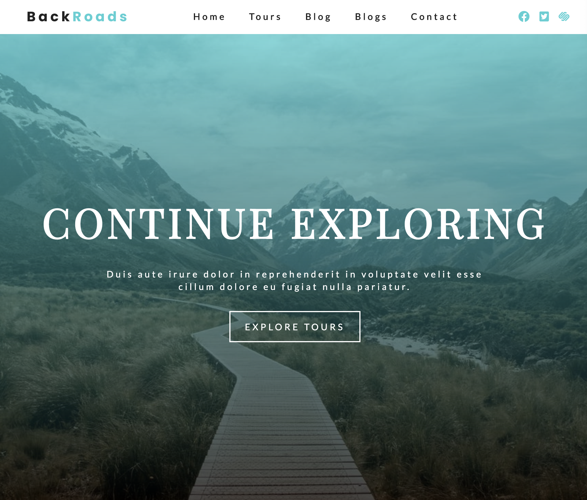

# Travel Agency Site

This is a travel agency site, built by Gatsby. It also includes a blog page. All content is stored in Contentful and the information is fecth by using GraphQL. So someone who is not technical can handle this website easily via Contentful, such as changing text, image and writing blogs. For the design, css module and component styled are used. This site benefits all Gatsby image features in terms of image optimization. Transition link plugin is also used between pages. SEO is applied using Reach Helmet. Mobile optimization is also applied.

# Demo
Click the link below to see the app.  
[netlify](https://travel-agency-koray.netlify.app/)

# Preview

# Technologies
  * Gatsby
  * JavaScript
  * GraphQL
  * Contentful CMS
  * Styled Component
  * CSS Module
  * Media Query
  * Transition Link
  * Gatsby Image Features
  * React Helmet for SEO

# Author

Koray Dündar